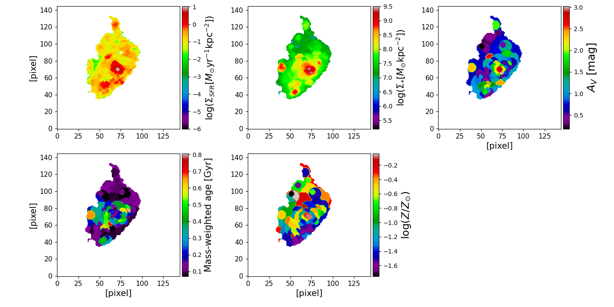

# Spatially resolved SED analysis on JWST and HST imaging data using piXedfit 

This repository provides a simple tutorial of the spatially resolved SED analysis with JWST and HST imaging data, similar to the analysis performed in [Abdurro'uf et al. (2023)](https://ui.adsabs.harvard.edu/abs/2023arXiv230102209A/abstract). 

## Analysis flow
* PSFs_kernels/Construct_PSFs_part.ipynb
* PSFs_kernels/Construct_kernels.ipynb
* images/construct_variance_images.ipynb
* images_processing.ipynb
* pixel_binning.ipynb
* models/Generate_model_restframe_spectra.ipynb
* SED_fitting.ipynb
* get_maps_properties.ipynb

## Analysis of MACS0647-JD z~11 galaxy

Analysis codes used for the photometry measurements of MACS0647-JD, a triply-lensed galaxy at z~11 ([Coe et al. 2023](https://ui.adsabs.harvard.edu/abs/2013ApJ...762...32C/abstract); [Hsiao et al. 2023](https://ui.adsabs.harvard.edu/abs/2022arXiv221014123H/abstract)).  
